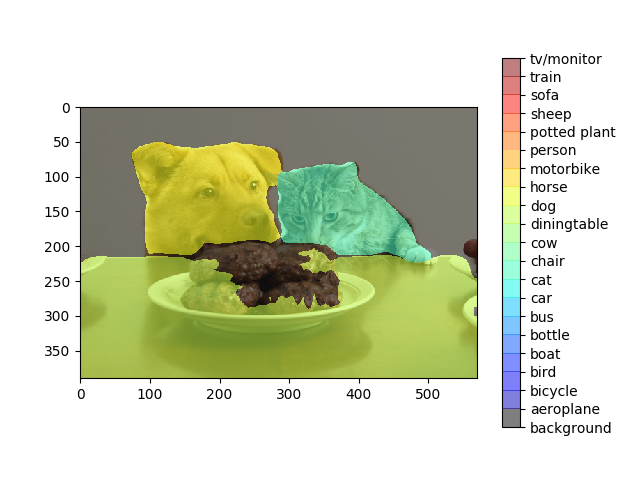
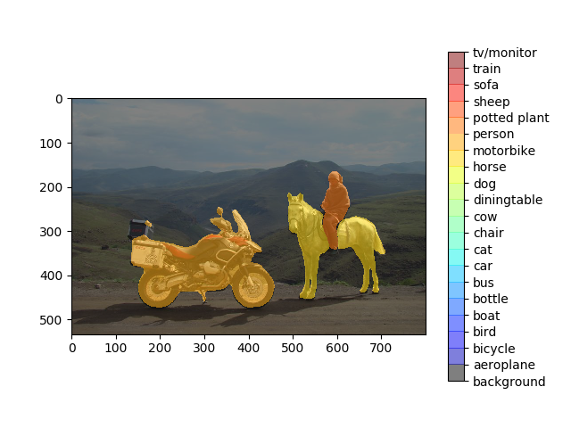

# FCN

PyTorch implementation of [Fully Convolutional Networks](https://github.com/shelhamer/fcn.berkeleyvision.org), for VGG and RESNET backbones.

  

## Requirements

- [pytorch](https://github.com/pytorch/pytorch) >= 1.1.0
- [torchvision](https://github.com/pytorch/vision) >= 0.3.0
- [fcn](https://github.com/wkentaro/fcn)
- [Jupyter Notebook](https://jupyter.org/)

`pip install -r requirements.txt`

## Data
`sh download.sh` will download the PascalVOC dataset inside **data** folder. 

## Training

`python main.py --gpu_id=0 --backbone=vgg --fcn=32s --root_dataset=./data/Pascal_VOC --mode=train`
- **backbone**: vgg or resnet [*vgg default*].
- **fcn**: 32s, 16s, 8s for vgg, and 101, 50 for resnet [*32s default*].
- **mode**: train, val, demo [*train default*].
- **resume**: For *val* and *demo*, if no resume path is given, code will use original FCN pre-trained weights.

### Acknowledgement
This repo is built upon [wkentaro](https://github.com/wkentaro/pytorch-fcn)'s code and some snippets can be just a mirror.
