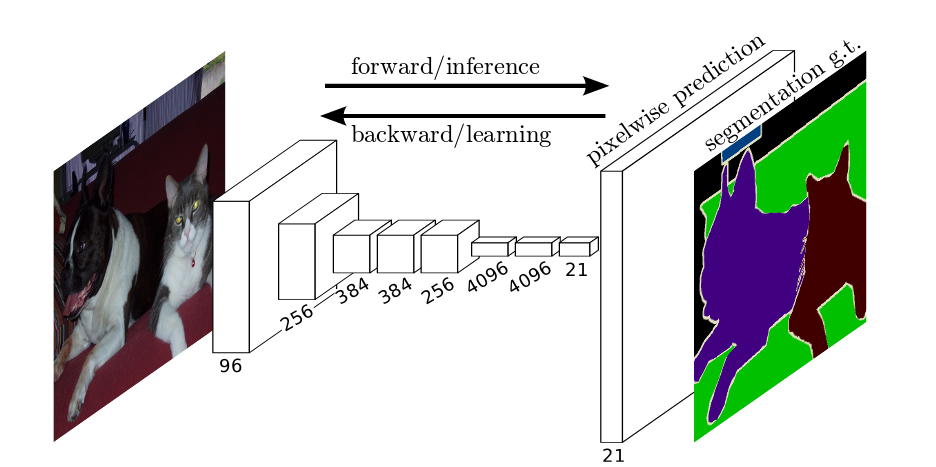
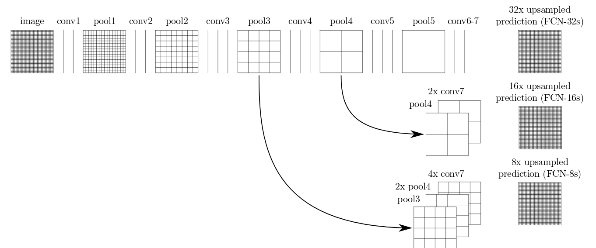
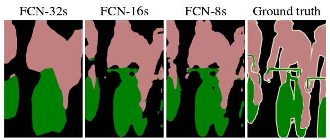

# Fully Convolutional Networks for Image Segmentation




## Pascal VOC


## FCN on Pascal VOC


## Resources
This lab contains 4 main Jupyter Notebooks for training and testing two FCN architectures: 32s and 16s. Note that 16s takes 32s model as input. It is strongly recommended to read the [paper](https://people.eecs.berkeley.edu/~jonlong/long_shelhamer_fcn.pdf) and get a nice grasp on the main ideas.

These scripts do the whole job, that is to download the dataset, prepare the data, train during N epochs and save the model. 

## New Server

We have access to a new machine with 2 more GPUs for our personal use. Use it wisely. 

```
user@paarbelaez.eastus.cloudapp.azure.com -p 50002
```

Your *user* is the same as in **bcv001**. 

## Your turn

1. Train 32s from vgg weights (finetuning).
2. Train 32s from scratch (**No** finetuninng). 
3. Train 16s from 32s weights.
4. Train 16s from vgg weights.
5. Train 16s from scratch.
6. Evaluate (Jaccard index) your performance.
7. Optional: To further evaluate your creativity, you also can come up with a new architecture and report your findings. 

## Report
We will relax the usual delivery requirements for this one. Upload a small report to you github, any format you like. Report one single table for the evaluation. Pros and Cons of 32s and 16s, i.e., when would be worth it to use 32s over 16s? And vice versa. Depict qualitative results using images in the wild.

## Deadline
**Thursday, May 2 2019, 11:59pm**

## Full disclosure
There is no Challenge at this time. 

I know...
